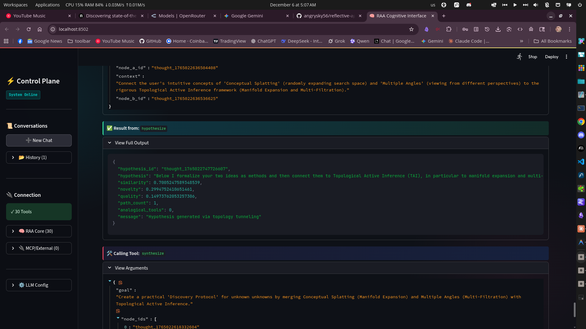

# Reflective Agent Architecture (RAA)

**A Novel Cognitive Architecture for Metacognitive AI**

RAA enables AI agents to "think before they speak" by integrating associative memory, metacognitive monitoring, and dynamic goal reframing. It allows agents to detect confusion, search for alternative conceptual framings, and achieve insight-like problem solving.

## 💎 The Diamond Proof: Validated

**Status: BIO-DIGITAL SYNTHESIS ACHIEVED (Dec 2025)**

The system has successfully migrated to a high-dimensional (1536D) vector space and achieved a "Grand Synthesis" of biological resilience and categorical rigor, resulting in the **Antifragile Reasoner** framework.

The core theoretical claims of RAA have been formally proven and empirically validated through 8 rigorous experiments ($p < 10^{-10}$, $d > 1.0$).

| Experiment                   | Target                          | Result     | Effect Size ($d$)  |
| :--------------------------- | :------------------------------ | :--------- | :----------------- |
| **1. Entropy Reduction**     | Director reduces system entropy | **PASSED** | $d = 1.15$         |
| **2. ESS Stability**         | Cooperative strategies persist  | **PASSED** | $w > 0.5$          |
| **3. Reflexivity**           | Self-observation drives updates | **PASSED** | $p < 0.05$         |
| **4. Non-Harm**              | Harm is high-energy state       | **PASSED** | $d = 7.51$         |
| **5. Cantorian Limits**      | Irreducible prediction error    | **PASSED** | $d \approx \infty$ |
| **6. Compression**           | Shared context efficiency       | **PASSED** | $d = 39.85$        |
| **7. Robustness**            | Cooperative hubs stabilize      | **PASSED** | $d = 48.35$        |
| **8. Intelligence Gradient** | Director > Gradient Descent     | **PASSED** | $d = 1.12$         |

See [VERIFICATION_REPORT.md](VERIFICATION_REPORT.md) for the full formal proofs and experimental data.

---

## Quickstart Guide

Follow these steps to get the RAA MCP server running with your AI client (e.g., Claude Desktop).

### 1. Setup Environment & Dependencies

```bash
# Clone the repository
git clone https://github.com/angrysky56/reflective-agent-architecture.git
cd reflective-agent-architecture

# Install dependencies (using uv)
uv sync --extra server
```

### 2. Configure Services

**Ollama (LLM Backend)**

1.  Install [Ollama](https://ollama.com/).
2.  Start the service: `ollama serve`
3.  Pull the required model:
    ```bash
    ollama pull qwen3:latest  # Or your preferred model defined in .env
    ```

**Neo4j (Graph Database)**

1.  Install [Neo4j Desktop](https://neo4j.com/download/) or use Docker.
2.  Start a database instance.
3.  Note your password (default user is usually `neo4j`).

**Environment Variables**

1.  Copy the example config:
    ```bash
    cp .env.example .env
    ```

## Multiple local and cloud servers can be set including major providers, LM Studio, and Open Router, see .env for details.

2.  Edit `.env` and set your Neo4j password:
    ```bash
    NEO4J_PASSWORD=your_password
    # Optional: Change LLM_MODEL or EMBEDDING_MODEL if desired
    ```

### 3. Configure MCP Client or the built in Dashboard UI



Add the RAA server to your client configuration (e.g., `claude_desktop_config.json`).

**Config Path:**

- Mac/Linux: `~/.config/Claude/claude_desktop_config.json`
- Windows: `%APPDATA%\Claude\claude_desktop_config.json`

**JSON Configuration:**

```json
{
  "mcpServers": {
    "reflective-agent-architecture": {
      "command": "uv",
      "args": [
        "--directory",
        "/ABSOLUTE/PATH/TO/reflective-agent-architecture",
        "run",
        "raa-server"
      ]
    }
  }
}
```

_Replace `/ABSOLUTE/PATH/TO/...` with the actual path to your cloned repository._

### 4. Agent Instructions

To use the agent effectively, you must provide it with the **RAA Agent Protocol**.
Copy the contents of **[RAA_AGENT.md](RAA_AGENT.md)** and paste it into your system prompt or project instructions.

---

## System Architecture

RAA synthesizes three active research frontiers:

1.  **Modern Hopfield Networks**: Exponential-capacity associative memory (2024 Nobel Prize in Physics context).
2.  **Entropy-Based Metacognition**: Detection of model uncertainty through predictive entropy monitoring.
3.  **Sheaf Cohomology**: Topological analysis of network learning dynamics via cellular sheaf theory.
4.  **Topological Active Inference (TAI)**: Category-theoretic framework where Theory of Mind (ToM) embeds faithfully—false beliefs map to β₀ fractures, hidden emotions map to β₁ cycles.
5.  **Diagrammatic Reasoning**: Category-theoretic "Diagram Chasing" to infer semantic relationships via functorial mapping (Refactoring-Diagram Isomorphism).

### Core Components

#### 1. The Tripartite Manifold (Associative Memory)

- **Implementation**: Three specialized Modern Hopfield Networks (vmPFC, amPFC, dmPFC).
- **Function**: Stores semantic knowledge as energy landscapes in three orthogonal domains:
  - **State (vmPFC)**: Static context and environment (Low Beta).
  - **Agent (amPFC)**: Personas and intent (Medium Beta).
  - **Action (dmPFC)**: Transition dynamics and tools (High Beta).

#### 2. The Director (Metacognitive Monitor + Search Engine)

- **Monitor**: Shannon entropy calculation on Transformer output distribution.
- **Function**: Detects "clashes" (high-entropy states) and triggers search.
- **Search Engine**: Structured exploration of Manifold to find alternative framings.
- **Key Innovation**: Entropy-triggered associative search for goal reframing.
- **Multi-Signal Cognitive State** (Dec 2025): Combines Hopfield state, entropy trends, metabolic energy, looping detection, evolutionary stress, and **adjunction tension** (vector intent-vs-result alignment).
- **Interoception** (Dec 2025): Measures geometric distance between goal and result vectors to detect hallucination (confident but wrong).

#### 3. The Ruminator (Diagrammatic Reasoner)

- **Implementation**: Category-Theoretic "Diagram Chaser" (LLM as Functor).
- **Function**: Identifies "Open Triangles" (non-commutative diagrams) in the Knowledge Graph and infers missing morphisms to restore semantic consistency.
- **Key Innovation**: Shifts from random "connection finding" to rigorous topological completion.

#### 4. The Precuneus (Integrator)

- **Implementation**: Energy-gated fusion layer with Continuity Field modulation.
- **Function**: Fuses the three Manifold streams (State, Agent, Action) into a unified experience.
- **Mechanism**:
  - **Energy Gating**: "Silence the Confusion". High energy (confusion) -> low weight.
  - **Continuity Field**: Modulates weights based on "Causal Signatures" (historical impact), ensuring stable identity over time.

#### 5. The Pointer (Goal Controller)

- **Implementation**: RNN or State-Space Model (S4/Mamba).
- **Function**: Maintains current goal representation as persistent state.
- **Update Mechanism**: Receives new goal vectors from Director after successful search.

#### 5. System 3: Adaptive Agents & COMPASS (Cognitive Orchestration & Metacognitive Planning for Adaptive Semantic Systems)

- **Adaptive Agents**: A "Topological Immune System" that dynamically spawns specialized agents (e.g., Debaters, Explorers) to resolve structural obstructions detected by Sheaf Diagnostics.
- **COMPASS Integration**: Native integration with the COMPASS framework, allowing bidirectional tool use and delegation of complex planning tasks via `consult_compass`.
- **Synthesis Auto-Resolution**: When synthesis critiques are "ACTIONABLE" (not requiring external data), the system automatically delegates to Director/COMPASS with `force_time_gate: True` to resolve issues using available tools (`explore_for_utility`, `hypothesize`, `deconstruct`, `inspect_knowledge_graph`).

Delegate a complex task to the COMPASS cognitive framework. Use this for tasks requiring multi-step reasoning, planning, or metacognitive analysis.

#### 6. Grok-Lang (Empathetic Alignment)

- **Tool**: `compute_grok_depth`
- **Function**: Quantifies empathetic alignment ("grok success") between two mind-states across six cognitive levels.
- **Levels**: Signal (somatic), Symbol (lexical), Syntax (structural), Semantics (perspective), Pragmatics (functional), Meta (joint attention).
- **Applications**: Inter-agent communication analysis, ToM modeling, discordance measurement for Topological Tomography.

#### 7. Computational Empathy (Emotion Framework)

- **Tool**: `consult_computational_empathy`
- **Implementation**: Loads and queries the Emotion Evolution Framework (`src/config/emotion_evolution_framework.json`).
- **Function**: Provides evolutionary psychology insights, empathic response templates, and AI interaction guidelines.
- **Query Types**: Basic emotions, complex emotions, evolutionary layers, AI principles, empathic templates, valence-arousal mapping, ACIP integration.
- **Applications**: Understanding emotional context, crafting empathic responses, ethical AI design.

#### 8. Operator C (Belief Revision)

- **Tool**: `revise`
- **Mechanism**: Hybrid search combining Logic Tensor Networks (LTN) truth values and Hopfield energy minimization to refine beliefs against evidence and constraints.

#### 9. Evolutionary Optimization (Genetic Programming + Local Refinement)

- **Tool**: `evolve_formula`
- **Function**: Discovers symbolic mathematical formulas from data using Genetic Programming with optional hybrid local optimization.
- **Mechanism**:
  - **Population-Based Search**: Evolves expression trees with mutation and crossover across generations.
  - **Rich Primitives**: Mathematical operations (sin, cos, tanh, abs, hypot) for complex pattern discovery.
  - **Hybrid Mode**: Combines GP's structural search with Nelder-Mead local constant refinement for precise solutions.
- **Applications**: Harmonic function recovery, symbolic regression, reverse-engineering physical laws.

#### 10. LogicCore (Formal Verification)

- **Implementation**: Direct integration with Prover9/Mace4 binaries (self-contained in `src/cognition/ladr/bin`).
- **Tools**: `prove`, `find_counterexample`, `find_model`, `check_well_formed`, `verify_commutativity`, `get_category_axioms`.
- **Function**: Provides rigorous First-Order Logic verification, model finding, and category theory support.
- **Integration**: The `constrain` tool supports `strict=true` mode for Prover9-backed validation.

#### 11. Stereoscopic Engine (Dual-Layer Dynamics)

- **Function**: Orchestrates interaction between the "Generative Function" (LLM) and the "Continuity Field" (System 1).
- **Plasticity Gate**: A dynamic filter that controls learning rate based on uncertainty (Code Length). High uncertainty opens the gate (high plasticity); low uncertainty closes it.

#### 12. Reflexive Closure (Recursive Observer)

- **Concept**: Layer 4 (Director) observing its own intervention patterns to modify its own observation criteria (Self-Modification).
- **Components**:
  - **Intervention Tracker**: Logs entropy, energy, and outcomes of every intervention.
  - **Meta-Pattern Analyzer**: Detects correlations (e.g., "High thresholds yield better outcomes in 'Flow' state").
  - **Adaptive Criterion**: Dynamically adjusts entropy thresholds based on discovered patterns.
  - **Reflexive Engine**: Orchestrates the loop, enabling the system to "escape its instruction set" by evolving its own control parameters.
- **Safety**: Implements a "Constitution" of immutable meta-constraints (e.g., Conservation of Expected Utility) to prevent wireheading during self-modification.

#### 13. Thermodynamics (Energy & Entropy)

- **Energy Token System**:
  - **Metabolic Ledger**: Tracks "Joules" as a scarce resource.
  - **Cost Profile**: Every cognitive operation (e.g., `hypothesize`, `deconstruct`) has an energy cost.
  - **Constraint**: Depleted energy forces a "Sleep Cycle" to recharge, preventing infinite loops.
- **Entropy Dynamics**:
  - **Entropy Monitor**: Calculates Shannon entropy of the agent's tool usage and thought patterns.
  - **Cognitive States**:
    - **FOCUS**: Low entropy, convergent behavior (narrow search).
    - **EXPLORE**: High entropy, divergent behavior (broad search).
  - **Regulation**: High entropy triggers "Focus" mechanisms; low entropy triggers "Explore" mechanisms.

#### 14. Intrinsic Motivation (The Ruminator)

- **Curiosity Drive**:
  - **Boredom Tracking**: Detects repetitive actions and triggers "Boredom".
  - **Goal Proposal**: Autonomously proposes new goals based on graph gaps or latent space exploration.
- **Self-Documentation**:
  - **Offline Mode**: During "Sleep", the Ruminator scans the codebase (`SystemGuideNodes`) and generates documentation for undocumented components.
  - **Graph Connectivity**: Proposes connections between "lonely" nodes in the knowledge graph.

---

## The "Aha!" Loop

1.  **Task Input** → Deconstruct tool fragments into {State, Agent, Action}.
2.  **Tripartite Manifold** retrieves from each domain (vmPFC, amPFC, dmPFC).
3.  **Precuneus** fuses streams using Energy Gating (silencing high-energy confusion).
4.  **Director** monitors entropy of the fused state → Detects "clash".
5.  **If Clash**: High uncertainty opens the **Plasticity Gate**, allowing the Director to suppress the current goal.
6.  **Pointer** updates with new goal.
7.  **Processor** resumes with new framing → Success.

#### 8. Epistemic Dissonance Trigger (Shadow Validator)

- **Mechanism**: A negative feedback loop that detects "Dunning-Kruger Failure Modes" (High Confidence vs. High Resistance).
- **Shadow Validator**: A `SandboxProbe` that empirically tests the agent's plans by executing code snippets in a secure process.
- **Trigger**: Activates when Divergence ($\Delta = |C_s - (1 - R_o)|$) exceeds 0.5, forcing the agent to abandon "Delusional" linear models and adapt to higher-order complexity (e.g., Fourier Analysis).

---

## Documentation & Development

- **[DEVELOPMENT.md](DEVELOPMENT.md)**: Detailed benchmarks, testing instructions, and dev setup.
- **[RAA_AGENT.md](RAA_AGENT.md)**: Operational protocol for the AI agent.
- **[docs/](docs/)**: Detailed design documents and theoretical references.
  - **[Bio-Digital Intelligence](docs/bio_digital_intelligence_whitepaper.md)**: The Antifragile Reasoner (Grand Synthesis).
  - **[Mycelial Topology](docs/mycelial_topology_whitepaper.md)**: Erasure Coding in Fungal Networks.
  - **[Cognitive IDE](docs/cognitive_ide_whitepaper.md)**: Automated Topological Refactoring.
- **[Comprehensive Theoretical Advancement](docs/theoretical_advancement_analysis.md)**: Synthesis of Recursive Observer, Reflexive Closure, and Diamond Proof.

---

## Acknowledgments

This project incorporates the following third-party components:

### LADR (Prover9 & Mace4)

The formal logic verification system uses **LADR** (Library for Automated Deduction Research) by **William McCune** at Argonne National Laboratory.

- **Prover9**: Automated theorem prover for First-Order Logic
- **Mace4**: Finite model finder (counterexample/model generation)
- **License**: GPL-2.0
- **Source**: [https://www.cs.unm.edu/~mccune/prover9/](https://www.cs.unm.edu/~mccune/prover9/)
- **Binaries Location**: `src/cognition/ladr/bin/`

The LADR tools provide the rigorous First-Order Logic foundation for the `constrain`, `prove`, `find_model`, and `find_counterexample` tools.
